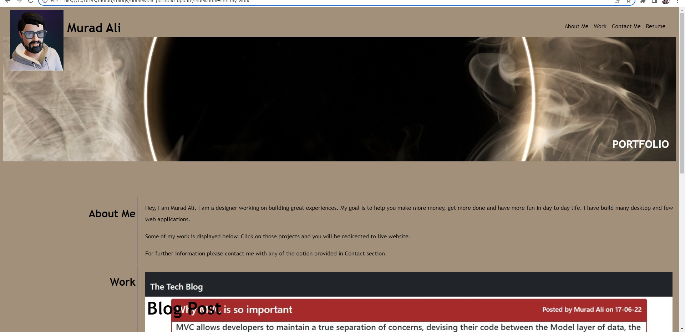
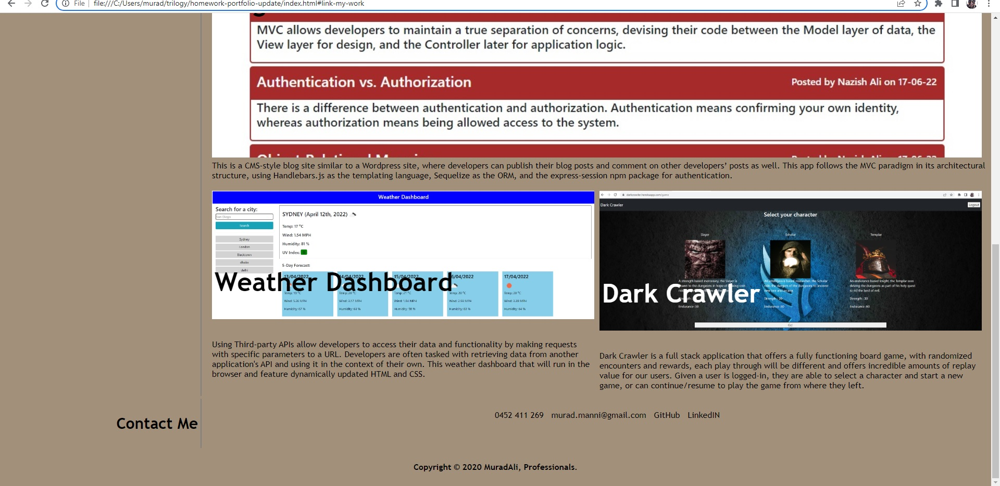

# PORTFOLIO
Bootcamp assignment

## Description

I used previous PORTFOILIO assignment and updated it with new projects and details.

## Table of Contents

- [URL (deployed application)](#url)
- [URL (github repository)](#urlrepo)
- [Layout](#layout)
- [Credits](#credits)
- [License](#license)

## URL (deployed application)

Following is the url link to access the deployed application.

https://muradmanni.github.io/homework-portfolio-professional/

## URL (github repository)

Following link is to access the code files using github repository.

https://github.com/muradmanni/homework-portfolio-professional

## Layout
   

   

## Credits

Previous portfolio assignment.

## License

The application is covered under the following license: [MIT](https://choosealicense.com/licenses/mit/)